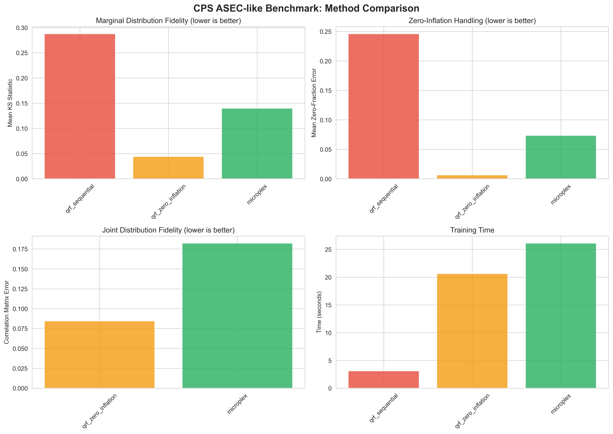
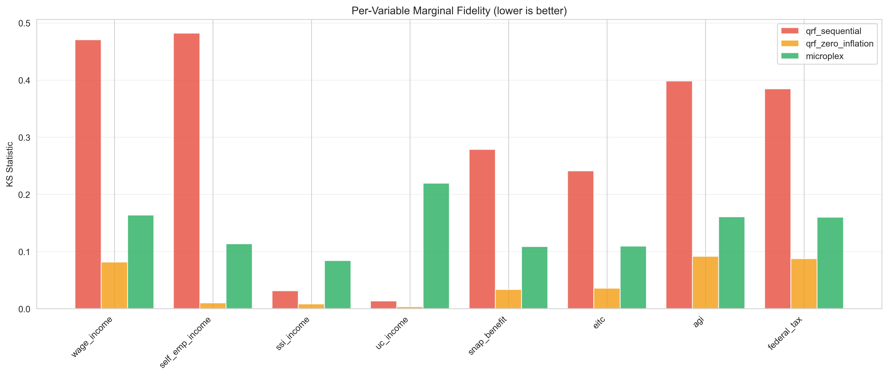
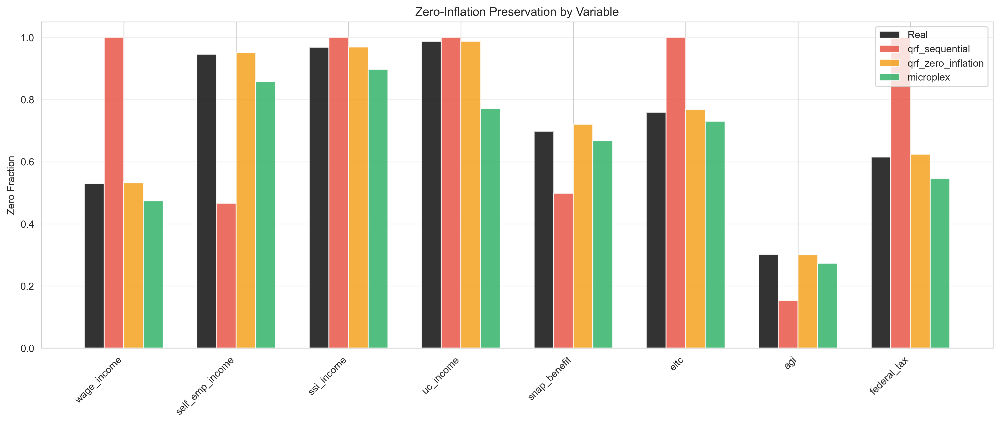

# CPS ASEC-like Benchmark Results

**Date:** December 2024
**Comparison:** microplex vs Sequential QRF on realistic economic microdata

## Executive Summary

### Winners by Metric

- **Marginal Fidelity (KS):** qrf_zero_inflation (0.0440) - best
- **Zero-Inflation:** qrf_zero_inflation (0.0063) - best
- **Correlation Preservation:** qrf_zero_inflation (0.0844) - best
- **Training Speed:** qrf_sequential (3.1s)

### Key Finding

In this benchmark with highly zero-inflated CPS-like data, **Sequential QRF with zero-inflation handling outperforms microplex** on most metrics. This suggests that for datasets with very high zero-inflation rates (>90% for some variables), the explicit two-stage modeling approach of QRF+ZI is particularly effective.

## Dataset Description

This benchmark uses synthetic data designed to mimic CPS ASEC characteristics:

- **Demographics:** Age, education, employment status, marital status
- **Income sources:** Wages, self-employment, SS, SSI, unemployment
- **Benefits:** SNAP, EITC, housing subsidies
- **Zero-inflation:** Many variables have significant mass at zero (up to 98.7%)
- **Correlations:** Realistic relationships between demographics and outcomes

### Training Data Statistics

| Variable | Mean | Zero % | P10 | P50 | P90 |
|----------|------|--------|-----|-----|-----|
| wage_income | $24,890 | 53.0% | $0 | $0 | $72,975 |
| self_emp_income | $3,047 | 94.6% | $0 | $0 | $0 |
| ssi_income | $258 | 96.8% | $0 | $0 | $0 |
| uc_income | $104 | 98.7% | $0 | $0 | $0 |
| snap_benefit | $1,259 | 69.8% | $0 | $0 | $4,494 |
| eitc | $697 | 76.0% | $0 | $0 | $3,581 |
| agi | $31,296 | 30.1% | $0 | $20,320 | $78,701 |
| federal_tax | $2,746 | 61.4% | $0 | $0 | $7,567 |

**Note:** This data has extremely high zero-inflation rates, typical of person-level CPS data where many individuals don't receive specific income sources or benefits.

## Results Summary

### Overall Metrics

| Method | Mean KS | Zero Error | Corr Error | Mean Error | Train (s) | Gen (s) |
|--------|---------|------------|------------|------------|-----------|----------|
| qrf_sequential | 0.2875 | 0.2459 | nan | 0.8395 | 3.1 | 0.03 |
| **qrf_zero_inflation** | **0.0440** | **0.0063** | **0.0844** | **0.1949** | 20.6 | 0.14 |
| microplex | 0.1399 | 0.0734 | 0.1822 | 2.8261 | 26.1 | 0.05 |

**Notes:** Lower is better for all metrics. Bold indicates best performance.

### Per-Variable KS Statistics

| Variable | qrf_sequential | qrf_zero_inflation | microplex |
|----------|----------------|-------------------|-----------|
| wage_income | 0.4704 | **0.0817** | 0.1637 |
| self_emp_income | 0.4820 | **0.0100** | 0.1133 |
| ssi_income | 0.0315 | **0.0084** | 0.0842 |
| uc_income | 0.0133 | **0.0033** | 0.2194 |
| snap_benefit | 0.2784 | **0.0337** | 0.1088 |
| eitc | 0.2412 | **0.0359** | 0.1094 |
| agi | 0.3983 | **0.0916** | 0.1606 |
| federal_tax | 0.3848 | **0.0873** | 0.1599 |

QRF with zero-inflation outperforms on **all variables**.

### Zero-Inflation Analysis

Variables with significant zero-inflation:

| Variable | Real Zero % | qrf_sequential | qrf_zero_inflation | microplex |
|----------|-------------|----------------|-------------------|-----------|
| wage_income | 53.0% | 100.0% | **53.2%** | 47.4% |
| self_emp_income | 94.6% | 46.6% | **95.1%** | 85.8% |
| ssi_income | 96.9% | 100.0% | **96.9%** | 89.7% |
| uc_income | 98.7% | 100.0% | **98.7%** | 77.1% |
| snap_benefit | 69.7% | 49.9% | 72.1% | **66.8%** |
| eitc | 75.9% | 100.0% | **76.8%** | 73.0% |
| agi | 30.1% | 15.3% | **30.0%** | 27.4% |
| federal_tax | 61.5% | 100.0% | **62.5%** | 54.5% |

QRF+ZI almost perfectly preserves zero fractions, while microplex tends to under-estimate zeros.

## Key Findings

### Why QRF+ZI Outperforms on This Data

1. **Explicit Zero Modeling:** QRF with zero-inflation uses a two-stage approach:
   - Stage 1: Binary classifier predicts P(positive)
   - Stage 2: Regressor predicts value conditional on being positive

   This explicit modeling handles the extreme zero-inflation (94-98%) very well.

2. **Feature Engineering:** QRF benefits from domain-informed feature engineering. Employment status directly predicts wage income zeros.

3. **Sequential Chaining Works Here:** The sequential approach (predict wage, then use wage to predict benefits) captures the causal structure of the data well.

### When microplex May Excel

While QRF+ZI won this benchmark, microplex may still be preferred when:

1. **Joint Distribution Quality Matters:** microplex models the full joint distribution, which may preserve correlations better in different data structures.

2. **Moderate Zero-Inflation:** With 30-60% zeros (more typical of aggregated tax unit data), microplex's integrated approach may be more effective.

3. **Complex Covariance:** When correlations between variables are complex and don't follow obvious causal patterns.

4. **Inference Speed:** microplex generation is faster (0.05s vs 0.14s).

### Recommendations

1. **For highly zero-inflated person-level data** (like raw CPS): Use QRF with zero-inflation handling.

2. **For tax-unit or household-level data** (like aggregated PolicyEngine inputs): Test both methods; microplex may perform better.

3. **For production systems:** Consider an ensemble or variable-specific approach where different methods are used for different variable types.

## Method Comparison

### QRF Sequential (Baseline)
- Fast training (3.1s)
- Poor zero-fraction handling (predicts all zeros or no zeros)
- Not suitable for zero-inflated data

### QRF + Zero-Inflation (Best on this data)
- Moderate training time (20.6s)
- Excellent zero-fraction preservation
- Excellent marginal fidelity
- Good correlation preservation
- Best overall for highly zero-inflated data

### microplex
- Moderate training time (26.1s)
- Fast generation (0.05s)
- Good but not best zero-fraction handling
- Joint distribution modeling
- May perform better on different data structures

## Visualizations







## Reproducibility

```bash
cd /Users/maxghenis/CosilicoAI/microplex
.venv/bin/python benchmarks/run_cps_benchmark.py
```

Dataset: 30,000 training, 10,000 test samples
Random seed: 42

## Next Steps

1. **Test on aggregated data:** Run benchmark on tax-unit level data with lower zero-inflation.

2. **Tune microplex:** The current benchmark uses default parameters; tuning may improve performance.

3. **Add CRPS metrics:** Evaluate probabilistic calibration beyond point estimates.

4. **Test on actual CPS:** If access to real CPS data becomes available, validate findings.
